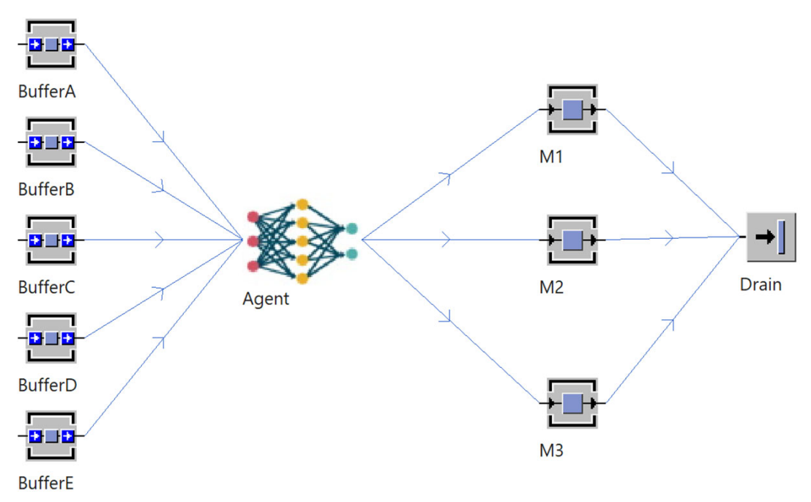

# Important chapters:
- 4 from 4.2 for an introduction to reinforcement learning
- 5 for the detailed integration into the simulation agent
- 6 shows the example scenario using a single neural network
- 7 for the evaluation

The other chapters may contain useful information as well but are not as relevant for the project

# Chapter 4:

## Basics

Reinforcement learning aims to improve a model through trial and error over time. 
It learns from the good results it achieves by going through iterations of the problem.

Reinforcement learning is based on an environmental model using these key components:
- Agent: the machine learning model interacting with its environment
- Environment: an interactive abstraction of the scenario the agent is in
- State: the state of the environment
- Action: operations the Agent performs based on the state
- Policy: defines the action the agent takes based on the state. In our case, this is done by a neural network.
- Reward: Based on the state changes after an action, the Agent is rewarded or punished. If successful, the model is enhanced.

**Single Agent vs. Multiagent:** In more complex systems, it can be wise to use multiple agents.
Each agent has its environment, making it easier to model complex environments granularly.

## Q-Learning

Q-Learning is based on Quality-Values (Q-Values) which indicate, how profitable a given action is based on the current state.
They represent the expected reward in an optimal decision chain.
Based on how good the performed action was, the Q-Values are updated using the Q-Formula.

The Q-Values can be represented in several forms. For simpler problems, a table is often sufficient.
More complex problems often require the agent to adapt to unknown situations as the number of possible states is simply too large.
In this case, the table can be replaced by a neural (deep) network (DQN) which takes in the state of the environment as a vector and outputs the q values for a decision.

Double Q-Learning enhances the DQN by increasing its stability. Normal DQNs tend to overestimate the Q-Values and therefore the action decision.
Using two separate Neural Networks and randomly sample the Q-Values from them. This reduces the risk of overestimation.

To stop the model from "forgetting" previous information, experience replay is a used technique.
Instead of training the model only on the current environmental state, the training data consists also of data from previous iterations.

# Chapter 5

## Implementation of the agent
 
### 5.1 Interaction between the learning agent and environment
main components of the agent concept within the systems are the learning agent and the environment.
The learning agent interacts with the environment, it interchanges information with the simulation agent
which is part of the environment. The simulation agent controls the material flow within the system.

Learning agent sends an action to the simulation agent, the learning agent receives an answer from the simulation agent 
which contains the reward or punishment for the action. The learning agent uses this information to predict the next action.

Concret flow in the system: 
- learning agent gets initialised within the simulation environment
- learning agent awaits response form the simulation software
- in each iteration of the mStep function, an action is requested from the learning agent and afterwards is performed. Then, the current state of the system plus the reward is being transmitted back to learning agent. 
- The agent then initiates a training session and saves the data in a data store. If the action is not feasible or no further actions by the agent are necessary, the step function is terminated, and a new experimental run begins. Once all experiments are completed, the training ends

## 5.2 Process of the simulation agent 
The experiment only can be started if the learning agent is ready. At the beginning of each experiment, the experiment manager is resetting the state of the environment to the initial state.
The initial state is being defined by the previous experiments. 
In the beginning of the simulation, mStep is initiated. mStep is the main function of the simulation agent.
The function saves the current state of the system, initiates the actions of the learning agent and returns the reward back to the learning agent.

Within this main function, initially, the current state of the system is saved, for example, in tables within the simulation software. Following this, the simulation agent sends a request for an action to the learning agent and awaits the response. The responded action is also recorded in the table. Another method calculates the reward for the action. If the action is not feasible (e.g. the buffer is full or the station is occupied, see chapter 6), the simulation step is terminated. Otherwise, the action is executed by the simulation agent, 
and a training session in the learning agent is initiated. This includes saving the new state of the environment and transmitting necessary data to the learning agent. In each iteration of the mStep function, it is verified if more actions are required. Once all actions are executed, the experiment concludes, and the subsequent experiment commences.

## 5.3 Learning agent
The learning agent is called from within the simulation model via a batch script. The batch script initiates the learning agent and its neural networks. After that the learning agent waits for input data.

To get a balance between exploration and exploitation the epsilon-greedy algorithm is used. 
A random number is generated. If the number is smaller than epsilon, the agent chooses a random action. Otherwise, the agent asks the neural network for the best action.

### The learning process
The learning process is divided into three functions: 
- train: responsible for the whole training process
- remember: saves the data and adjusts epsilon
- replay: trains the neural network and updates the q-values

Once a simulation step is completed (at the end of mStep), the training process of the learning agent 
is initiated. The state, action, reward and new state are formatted and saved into the replay_buffer.
The replay_buffer works like a queue. Once it is full, the oldest data is removed. If there 
is enough data available, the epsilon value is reduced. 

In the training process, a small subset "mini_batch" of the replay_buffer is selected.
The subset contains a series of state-action pairs along with their corresponding rewards 
and information on whether the simulation step was terminated by the agents action of if another
step could be executed. Predictions are made from both neural networks using the states.
The predictions from the main network are saved as Q-values for the initial states, while
predictions from the target network are saved as Q-values for the new states.

Next the Q-values in the batch are updated. This Q-values are fed into the neural network.

## 5.4 Technical development environment
We have the simulation agent in the simulation software which performs actions onto the 
environment. The learning agent is the intelligent part of the system.

# Chapter 6: Example of an application case in material flow simulation

## The task of the agent
The task of the AI agent is to move orders from 5 input buffers to 3 parallel working stations. The agent may choose the order in which the orders are moved into the machines, in an effort to minimize the lead time.

Each buffer has a capacity of 10 movable units. Each buffer contains a different type of movable unit, namely A, B, C, D and E.

Each of the stations has different processing times for each type of unit. The retooling times for each switch between units are the same for all 3 stations. 

## Structure of the simulation agent
The simulation agent's functionality can be grouped into seven segments:
* *environment data*: contains the `init`(ialize) method of the agent, stores the input objects and output objects of the agent, that is the direct neighbors of the agent in the simulation model.
* *functions*: workflow of the simulation agent. Contains the logic for performing an action, for calculating a reward and for storing actions and states into the corresponding tables.
* *parameters*: basically just a collection of important parameters
* *connections*: Socket server, logic for setting up and closing the connection to the RL agent
* *save & write data*: contains methods that send data to and receive data from the RL agent
* *dialog*: everything related to the user dialog to configure the simulation agent.
* *statistics*: statistics to show the agent's performance

### Observation space
The agent needs a description of the state of the system, based on some measurements and parameters. This collection of parameters is called **observation space**. In our case, a observation, representing the state of the system, consists of the following:
* The number of contained orders of each input buffer
* The occupancy of the 3 output stations (true/false)
* The tooling status for each of the 3 stations (A - E)

Thus, one observation contains 11 parameters.

### Action space
The agent also needs to know which actions it can take to manipulate the system. In our case, the agent may move an order from one of the five input buffers into one of the three stations. This results in an action space containing 15 different actions.

### Workflow of the agent

Remarks:
* in `mDoAction`, it is evaluated whether the action taken by the RL agent is valid. If not, the agent is punished and the loop is exited.

### Calculating the reward

Remarks:
* possible rewards are: -100, +25, +40
* in the calculation the different processing times of the stations for each MU are not considered

## Structure of the learning agent
The learning agent can perform seven different tasks:

### 1. Initialization
Initializes the agent. The agents is fed with the following hyperparameters:
* Observation space
* Action space
* Replay buffer: "memory" of the agent (stores the latest q values)
* Batch size
* Train start
* Epsilon
* Gamma

Additionally, it is fed with these hyperparameters for the DQN: 
* Shape of the observation space: used for the input layer
* Action space: serves as the output layer
* Learning rate
* Number of nodes in the hidden layer
* Activation function

### 2. Training
Fetches a batch of states from the agent's memory and trains the DQN based on the Q values for these states.

### 3. Choose an action
The agent is fed with an observation (state of the system) and returns an action to perform.

Some of these actions are chosen randomly, as the agent uses the *[Epsilon-Greedy algorithm](https://www.geeksforgeeks.org/epsilon-greedy-algorithm-in-reinforcement-learning/) to balance between exploration and exploitation.

The other actions are predictions by the DQN.

### 4. Choose an action (DQN only)
Same as (3), but the agent does only perform DQN predictions to choose an action.

### 5. - 7.
These are irrelevant for the understanding of this paper.

### Structure of the neural network
Please refer to chapter 6.4.4 of the master thesis. There, the structure of the DQN is already explained in a concise manner.

# Chapter 7 Summary: Evaluation and Analysis

## Verification and Validation
The section demonstrates that the developed system functions correctly and yields expected outcomes. Validation is accomplished by comparing the throughput from the simulation model to that of a theoretical model, with the results closely aligning, suggesting a successful implementation.

## Learning Ability of the Agent
This section demonstrates the agent's ability to learn and refine its strategies for task sequencing, as indicated by a significant metric: the proportion of successful steps in experiments. Initially, only 10% of the steps in the first 1,300 experiments are successful, highlighting a high rate of termination and suggesting limited effectiveness of the agent's decision-making. However, a notable transformation occurs beyond this phase, where the rate of successful steps escalates to approximately 100%. 

## Prediction Accuracy of the Network
This section explores the critical distinction between experiment terminations resulting from the RL agent's decisions and those arising from random choices. As the experiment progresses and extends, an essential phenomenon emerges: overtraining leads to overfitting, which intermittently causes the agent to make incorrect sequencing decisions. This overfitting results in a phase-wise degradation in the quality of the agent's performance, indicating that excessive training can diminish the model's generalizability and its ability to make accurate predictions in varying scenarios. Despite these challenges, the experiment demonstrates periods during which the agent achieves a remarkably high prediction accuracy rate of up to 98% at experiment 2100 - 5000. This indicates that, under certain conditions, the RL agent can highly accurately predict optimal actions, showcasing its potential for effective decision-making. 

## Testing and Critical Examination of the Learning Agent
As observed before the neural network reachs its peak predictive performance at approximately 4,500 conducted experiments. Consequently, the network is trained only up to this point before being deployed. This strategy aims to harness the best possible predictive accuracy from the network without the detrimental effects of overtraining.
However, challenges remain in the form of incorrect decisions leading to the termination of the agent's operation. Notably, even introducing a mechanism to prompt the RL agent for a decision after a certain period or following a wrong choice—by making a random decision—does not effectively mitigate these errors. Therefore, this approach still falls short when compared to heuristic methods, particularly in scenarios where the agent faces predominantly empty buffers and struggles to select the appropriate buffer for action.

