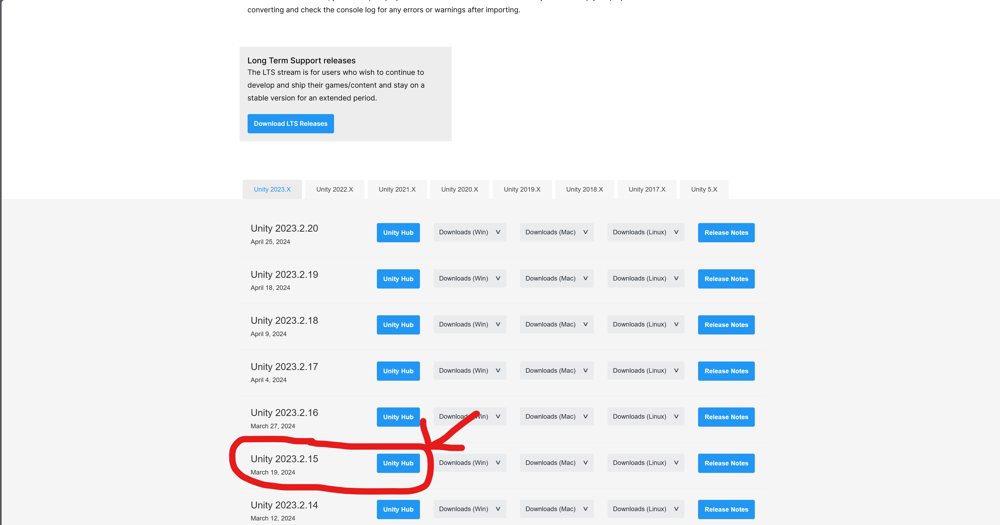

## Install unity 2023.2.15
- [install Unity Hub](https://unity.com/download)

- Install version 2023.2.15

##  Install Anaconda (version : 24.3.0)
Download link -> [https://www.anaconda.com/download](https://www.anaconda.com/download)
## Clone the Unity_Event_Production repository
```sh
git clone https://github.com/RoyalResearchGroup/Unity_Event_Production.git
```
## Create conda environment and install necessary modules:
- create a new environment with necessary python and instantly activate it: 
```sh
conda create -n mlagents python=3.10.12 && conda activate mlagents
```

- install torch within the environment
```sh
pip3 install torch~=2.2.1 --index-url https://download.pytorch.org/whl/cu121
```
open command line within the directory where the repository is located
- cd to ./Unity_Event_Production/setupResources
```sh
cd ./setupResources
```
- install the two packages within the environment
 ```sh
python -m pip install ./ml-agents-envs
python -m pip install ./ml-agents
```